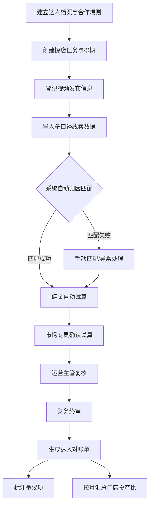

## 1. 产品概述

面向医美连锁品牌市场部的达人探店佣金结算系统，解决团购、私域到院和项目成交三种口径不一致导致的佣金核算混乱问题。目标用户为多门店医美连锁的市场专员、运营主管和财务人员，核心价值在于统一归因口径、自动试算佣金、多级审批对账，实现达人投放ROI的透明化管理。

## 2. 核心功能

### 2.1 用户角色

| 角色 | 注册方式 | 核心权限 |
|------|----------|----------|
| 市场专员 | 管理员分配账号 | 录入达人档案、创建探店任务、登记视频信息、导入成交数据、发起佣金试算 |
| 运营主管 | 管理员分配账号 | 复核佣金试算、处理异常线索、审核争议项 |
| 财务人员 | 管理员分配账号 | 终审佣金、确认打款、导出对账单、查看投产比报表 |
| 系统管理员 | 系统初始化 | 管理用户账号、配置佣金档位、管理门店信息 |

### 2.2 功能模块

1. **工作台首页**: 关键指标概览、待办事项、异常提醒、月度投产比趋势
2. **达人档案管理**: 达人信息录入与维护、合作规则配置
3. **探店排期管理**: 探店任务创建与排期、视频发布跟踪
4. **线索核销管理**: 团购券核销、咨询预约、面诊到院数据导入
5. **成交匹配归因**: 多口径数据归因匹配、异常线索处理
6. **佣金试算中心**: 佣金自动试算、多级审批流程
7. **财务确认中心**: 财务终审、对账单生成、投产比报表

### 2.3 页面详情

| 页面名称 | 模块名称 | 功能描述 |
|----------|----------|----------|
| 工作台首页 | 指标概览 | 展示本月达人数、探店任务数、应结佣金总额、投产比等核心指标 |
| 工作台首页 | 待办事项 | 展示待复核、待终审、争议待处理等待办条目 |
| 工作台首页 | 异常提醒 | 高亮展示跨门店重复线索、退款异常、匹配失败等 |
| 工作台首页 | 月度趋势 | 达人投产比月度折线图、佣金支出月度柱状图 |
| 达人档案列表 | 达人列表 | 按平台/粉丝量/合作门店/状态筛选达人，支持搜索 |
| 达人档案列表 | 批量操作 | 批量修改佣金档位、批量分配门店 |
| 达人详情页 | 基本信息 | 账号平台、粉丝量、联系方式、合作门店、佣金档位 |
| 达人详情页 | 合作记录 | 历史探店任务、佣金结算记录、产出数据 |
| 达人详情页 | 佣金档位 | 配置不同项目类别的提成比例（玻尿酸/光电/皮肤管理等） |
| 探店排期列表 | 任务列表 | 按门店/达人/日期/状态筛选探店任务 |
| 探店排期列表 | 日历视图 | 日历模式展示排期，支持拖拽调整 |
| 探店任务创建 | 基本信息 | 选择达人、门店、到店日期、拍摄项目 |
| 探店任务创建 | 报价方式 | 按单次报价/按成交提成/混合报价 |
| 探店任务创建 | 视频登记 | 视频链接、发布时间、约定保留时长 |
| 线索核销列表 | 数据总览 | 各口径线索数量统计（团购核销/咨询预约/面诊到院/项目成交） |
| 线索核销导入 | 团购券核销 | 导入团购券核销明细（券码、手机号、核销时间、核销门店） |
| 线索核销导入 | 咨询预约 | 导入咨询预约数据（手机号、预约时间、咨询项目） |
| 线索核销导入 | 面诊到院 | 导入面诊到院记录（手机号、到院时间、面诊医生） |
| 线索核销导入 | 项目成交 | 导入项目成交明细（手机号、成交项目、成交金额、成交时间） |
| 成交匹配列表 | 匹配结果 | 按手机号/券码/客服备注自动匹配归因，标注匹配口径 |
| 成交匹配列表 | 异常处理 | 跨门店重复线索、退款扣减、未成单标记 |
| 成交匹配列表 | 手动匹配 | 系统未匹配的线索支持手动关联 |
| 佣金试算列表 | 试算记录 | 各达人各任务的佣金试算结果，区分项目类别 |
| 佣金试算详情 | 试算明细 | 逐条展示成交记录、匹配口径、提成比例、应结金额 |
| 佣金试算详情 | 扣减项 | 展示退款扣减、未成单扣减、跨门店重复扣减明细 |
| 佣金试算详情 | 审批流程 | 市场专员提交→运营主管复核→财务终审 |
| 财务确认列表 | 终审列表 | 待终审和已终审的佣金结算单 |
| 财务确认列表 | 打款确认 | 确认已打款并记录打款信息 |
| 达人对账单 | 对账单详情 | 单个达人的月度对账单，含明细和汇总 |
| 达人对账单 | 争议标注 | 标注争议项并记录争议原因和处理结果 |
| 门店投产比 | 投产比报表 | 按月汇总各门店达人投产比（投入佣金/产出成交额） |
| 门店投产比 | 达人排名 | 门店下达人ROI排名 |

## 3. 核心流程

用户首先建立达人合作规则（档案+佣金档位），然后创建探店任务并登记视频信息。达人发布内容后，市场专员定期导入各口径的线索数据（团购核销/咨询预约/面诊到院/项目成交），系统按手机号、券码、客服备注进行多口径归因匹配，区分不同项目类别的提成比例自动试算佣金，自动扣除退款、未成单和跨门店重复线索。市场专员确认试算结果后提交，运营主管复核，财务终审并生成达人对账单，标注争议项。最终按月汇总门店达人投产比。

## 4. 用户界面设计

### 4.1 设计风格

- **主色调**: 深邃藏蓝(#1a1f36)搭配翡翠绿(#10b981)强调色，传达专业可信赖的商务感
- **辅助色**: 琥珀黄(#f59e0b)用于警示和待办提醒，珊瑚红(#ef4444)用于异常和扣减
- **按钮风格**: 圆角6px，主按钮填充色，次按钮描边，禁用态灰化
- **字体**: 标题使用 Noto Sans SC Bold，正文使用 Noto Sans SC Regular，数字使用 DM Mono 等宽字体
- **布局风格**: 左侧固定导航栏 + 顶部面包屑 + 内容区域卡片式布局
- **图标风格**: 线性图标(Stroke)，统一2px描边

### 4.2 页面设计概览

| 页面名称 | 模块名称 | UI元素 |
|----------|----------|--------|
| 工作台首页 | 指标概览 | 4个数据卡片(深色渐变背景+大号数字+趋势箭头)，横排布局 |
| 工作台首页 | 待办事项 | 列表卡片，左侧彩色竖条标识优先级，右侧操作按钮 |
| 工作台首页 | 异常提醒 | 红色边框卡片，图标+文案+处理按钮 |
| 工作台首页 | 月度趋势 | 双轴折线柱状图，深色图表区域 |
| 达人档案列表 | 达人列表 | 表格布局，头像+昵称+平台标签+粉丝量+状态徽章 |
| 达人详情页 | 佣金档位 | 分组卡片，每组显示项目类别+提成比例滑块 |
| 探店排期 | 日历视图 | 月历网格，任务色块标注，点击弹出详情 |
| 探店任务创建 | 表单 | 分步表单(基本信息→报价方式→视频登记)，步骤指示器 |
| 线索核销导入 | 导入面板 | 拖拽上传区域+模板下载链接+预览表格 |
| 成交匹配列表 | 匹配结果 | 表格行，匹配状态彩色标签(绿/黄/红)，口径来源标签 |
| 佣金试算详情 | 试算明细 | 嵌套表格(达人→任务→成交明细)，底行汇总加粗 |
| 佣金试算详情 | 审批流程 | 横向步骤条，已完成节点打勾，当前节点高亮 |
| 财务确认列表 | 终审列表 | 表格+批量操作栏，状态筛选标签页 |
| 达人对账单 | 对账单详情 | 打印友好布局，表头+明细表+汇总行+签章区域 |
| 门店投产比 | 投产比报表 | 数据表格+热力图矩阵(门店×月份) |

### 4.3 响应式设计

- 桌面优先设计，最小支持1280px宽度
- 平板端(768-1280px)侧边栏折叠为图标模式
- 移动端(<768px)侧边栏隐藏，改为底部Tab导航，表格改为卡片列表

### 4.4 无3D场景需求
