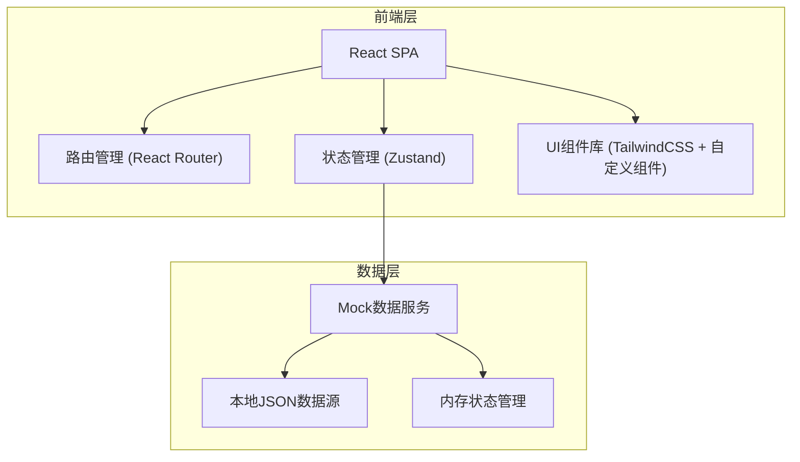
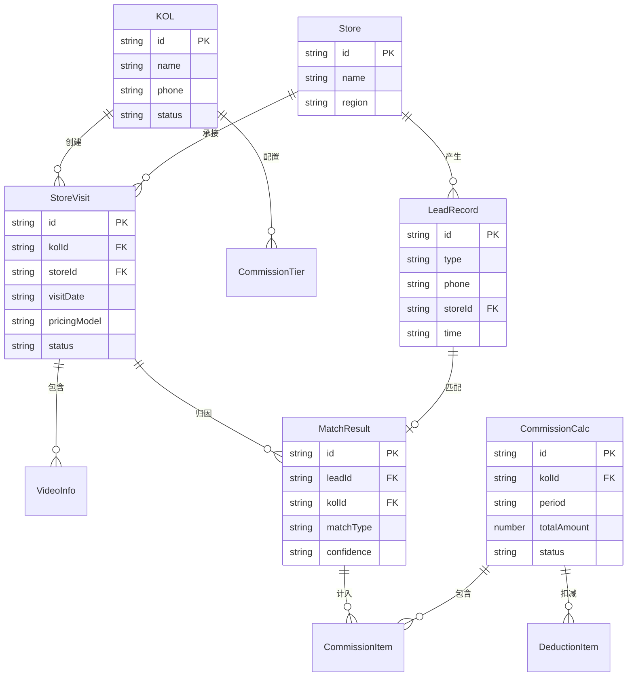

## 1. 架构设计



## 2. 技术说明

- **前端框架**: React@18 + TypeScript
- **构建工具**: Vite
- **样式方案**: TailwindCSS@3 + CSS Variables 主题
- **路由**: React Router v6
- **状态管理**: Zustand（轻量级，适合中型应用）
- **图表库**: Recharts（基于React的图表组件）
- **日期处理**: dayjs
- **图标**: Lucide React（线性风格图标）
- **后端**: 无后端，使用前端Mock数据模拟
- **数据持久化**: localStorage + Zustand persist 中间件

## 3. 路由定义

| 路由 | 用途 |
|------|------|
| `/` | 工作台首页 - 指标概览、待办、异常提醒 |
| `/kol` | 达人档案列表 |
| `/kol/:id` | 达人详情页 |
| `/schedule` | 探店排期列表 |
| `/schedule/create` | 创建探店任务 |
| `/verification` | 线索核销列表 |
| `/verification/import` | 线索数据导入 |
| `/matching` | 成交匹配列表 |
| `/commission` | 佣金试算列表 |
| `/commission/:id` | 佣金试算详情 |
| `/finance` | 财务确认列表 |
| `/statement/:kolId` | 达人对账单 |
| `/roi` | 门店投产比报表 |

## 4. API定义（Mock）

### 4.1 达人相关

```typescript
interface KOL {
  id: string
  name: string
  platforms: { type: 'douyin' | 'xiaohongshu' | 'kuaishou' | 'bilibili'; account: string; followers: number }[]
  phone: string
  stores: string[]
  commissionTiers: CommissionTier[]
  status: 'active' | 'inactive'
  createdAt: string
}

interface CommissionTier {
  category: 'filler' | 'laser' | 'skin' | 'surgery' | 'other'
  rate: number
  baseAmount?: number
}
```

### 4.2 探店任务

```typescript
interface StoreVisit {
  id: string
  kolId: string
  storeId: string
  visitDate: string
  projectTypes: string[]
  pricingModel: 'fixed' | 'commission' | 'hybrid'
  fixedPrice?: number
  commissionRate?: number
  videos: VideoInfo[]
  status: 'scheduled' | 'filming' | 'published' | 'completed'
}

interface VideoInfo {
  url: string
  platform: string
  publishedAt: string
  retentionDays: number
}
```

### 4.3 线索核销

```typescript
interface LeadRecord {
  id: string
  type: 'coupon' | 'consultation' | 'visit' | 'transaction'
  phone: string
  couponCode?: string
  storeId: string
  time: string
  project?: string
  amount?: number
  doctor?: string
  remark?: string
  source: 'group_buy' | 'private_domain' | 'walk_in'
}
```

### 4.4 成交匹配

```typescript
interface MatchResult {
  id: string
  leadId: string
  kolId: string
  storeVisitId: string
  matchType: 'phone' | 'coupon' | 'remark' | 'manual'
  confidence: 'high' | 'medium' | 'low'
  transactionAmount: number
  projectCategory: string
  isRefunded: boolean
  isDuplicate: boolean
  storeId: string
}
```

### 4.5 佣金试算

```typescript
interface CommissionCalc {
  id: string
  kolId: string
  storeVisitId: string
  period: string
  items: CommissionItem[]
  deductions: DeductionItem[]
  totalAmount: number
  status: 'draft' | 'submitted' | 'reviewed' | 'approved' | 'rejected'
  approver?: string
  approvedAt?: string
}

interface CommissionItem {
  matchResultId: string
  projectCategory: string
  rate: number
  baseAmount: number
  commissionAmount: number
}

interface DeductionItem {
  type: 'refund' | 'no_deal' | 'duplicate'
  amount: number
  description: string
  relatedMatchId?: string
}
```

## 5. 无后端服务架构

本项目为纯前端应用，所有数据通过 Zustand store + localStorage 持久化，模拟完整的业务流程。

## 6. 数据模型

### 6.1 数据模型定义



### 6.2 数据定义

```sql
-- 门店表
CREATE TABLE store (
  id VARCHAR(36) PRIMARY KEY,
  name VARCHAR(100) NOT NULL,
  region VARCHAR(50),
  address VARCHAR(200),
  status VARCHAR(20) DEFAULT 'active'
);

-- 达人表
CREATE TABLE kol (
  id VARCHAR(36) PRIMARY KEY,
  name VARCHAR(50) NOT NULL,
  phone VARCHAR(20),
  status VARCHAR(20) DEFAULT 'active',
  created_at TIMESTAMP DEFAULT CURRENT_TIMESTAMP
);

-- 达人平台信息
CREATE TABLE kol_platform (
  id VARCHAR(36) PRIMARY KEY,
  kol_id VARCHAR(36) REFERENCES kol(id),
  platform VARCHAR(20),
  account VARCHAR(100),
  followers INT DEFAULT 0
);

-- 佣金档位
CREATE TABLE commission_tier (
  id VARCHAR(36) PRIMARY KEY,
  kol_id VARCHAR(36) REFERENCES kol(id),
  category VARCHAR(20),
  rate DECIMAL(5,4) NOT NULL,
  base_amount DECIMAL(10,2)
);

-- 探店任务
CREATE TABLE store_visit (
  id VARCHAR(36) PRIMARY KEY,
  kol_id VARCHAR(36) REFERENCES kol(id),
  store_id VARCHAR(36) REFERENCES store(id),
  visit_date DATE NOT NULL,
  pricing_model VARCHAR(20),
  fixed_price DECIMAL(10,2),
  commission_rate DECIMAL(5,4),
  status VARCHAR(20) DEFAULT 'scheduled'
);

-- 视频信息
CREATE TABLE video_info (
  id VARCHAR(36) PRIMARY KEY,
  store_visit_id VARCHAR(36) REFERENCES store_visit(id),
  url VARCHAR(500),
  platform VARCHAR(20),
  published_at TIMESTAMP,
  retention_days INT
);

-- 线索记录
CREATE TABLE lead_record (
  id VARCHAR(36) PRIMARY KEY,
  type VARCHAR(20) NOT NULL,
  phone VARCHAR(20),
  coupon_code VARCHAR(50),
  store_id VARCHAR(36) REFERENCES store(id),
  time TIMESTAMP NOT NULL,
  project VARCHAR(100),
  amount DECIMAL(10,2),
  doctor VARCHAR(50),
  remark TEXT,
  source VARCHAR(20)
);

-- 成交匹配
CREATE TABLE match_result (
  id VARCHAR(36) PRIMARY KEY,
  lead_id VARCHAR(36) REFERENCES lead_record(id),
  kol_id VARCHAR(36) REFERENCES kol(id),
  store_visit_id VARCHAR(36) REFERENCES store_visit(id),
  match_type VARCHAR(20),
  confidence VARCHAR(10),
  transaction_amount DECIMAL(10,2),
  project_category VARCHAR(20),
  is_refunded BOOLEAN DEFAULT FALSE,
  is_duplicate BOOLEAN DEFAULT FALSE,
  store_id VARCHAR(36) REFERENCES store(id)
);

-- 佣金试算
CREATE TABLE commission_calc (
  id VARCHAR(36) PRIMARY KEY,
  kol_id VARCHAR(36) REFERENCES kol(id),
  store_visit_id VARCHAR(36) REFERENCES store_visit(id),
  period VARCHAR(7),
  total_amount DECIMAL(10,2),
  status VARCHAR(20) DEFAULT 'draft',
  approver VARCHAR(50),
  approved_at TIMESTAMP
);

-- 佣金明细
CREATE TABLE commission_item (
  id VARCHAR(36) PRIMARY KEY,
  calc_id VARCHAR(36) REFERENCES commission_calc(id),
  match_result_id VARCHAR(36) REFERENCES match_result(id),
  project_category VARCHAR(20),
  rate DECIMAL(5,4),
  base_amount DECIMAL(10,2),
  commission_amount DECIMAL(10,2)
);

-- 扣减项
CREATE TABLE deduction_item (
  id VARCHAR(36) PRIMARY KEY,
  calc_id VARCHAR(36) REFERENCES commission_calc(id),
  type VARCHAR(20),
  amount DECIMAL(10,2),
  description TEXT,
  related_match_id VARCHAR(36)
);
```
